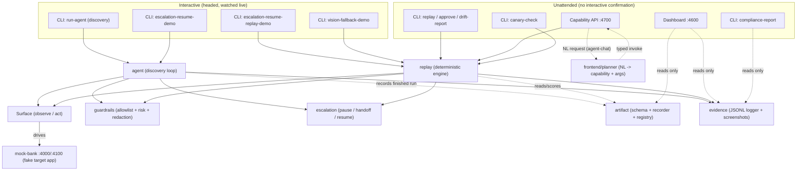

# System Design

## In one sentence

One process, seven small pieces that each do exactly one job, wired together so that
"learning a task" and "running a task" go through the same safety checks and the same way of
touching the screen — so replay can never quietly diverge from what discovery actually did.

---

## Part 1 — For everyone: how the pieces fit together

Imagine a small back-office team with clearly divided jobs, rather than one person trying to
do everything:

- **The Explorer** — sits down at a computer for the first time and figures out how to do a
  new task, describing out loud what they see and why they're clicking what they're clicking.
  (This is the **discovery agent**, powered by an AI model.)
- **The Note-Taker** — writes down everything the Explorer did as a precise recipe card, not a
  loose summary. (This is the **artifact recorder**.)
- **The Robot Arm** — the only one actually allowed to touch the mouse and keyboard, for
  either the Explorer or, later, whoever is following the recipe. (This is the **Surface**.)
- **The Compliance Officer** — stands next to the Robot Arm and has to say "yes, that's
  allowed" before *every single action*, whether it's the Explorer's first try or someone
  following an old recipe for the thousandth time. (This is **guardrails**.)
- **The Recipe-Follower** — given a recipe card and today's specific numbers (which member,
  how much money), follows it step by step, mechanically, checking after each step that it
  actually worked. (This is the **replay engine**.)
- **The Supervisor** — the person the Recipe-Follower calls over when something happens that
  isn't on the recipe card and isn't something they know how to handle safely alone. (This is
  **escalation**.)
- **The Scribe** — writes down, in detail, everything everyone did and why, and takes a
  photo whenever something goes wrong, so someone can review it later without having to have
  been in the room. (This is **evidence**.)

Everyone touches the *same* computer (the same live browser session) — the Supervisor doesn't
get handed a description of the problem and a fresh computer; they walk up to the exact same
screen the Recipe-Follower or Explorer was looking at.

### What if two of these people disagreed?

They can't, by design: the Compliance Officer is the *same* code whether the Explorer or the
Recipe-Follower is acting, so there's no way for "training mode" to be more permissive than
"production mode." If the Compliance Officer would have blocked something during discovery,
the identical check blocks the identical thing during replay.

---

## Part 2 — For engineers: architecture, module map, and data flow

### Why this shape

Single Node/TypeScript process, no queues, no separate services, no database — a deliberate
choice per the brief's own instruction not to build scaling infrastructure prematurely ("we do
not reward... building scaling infrastructure"). The interesting engineering problem here is
getting the *abstractions* right (so they *could* scale later), not standing up infrastructure
that has nothing real to justify it yet.

### The module map

Solid arrows are real runtime calls into shared logic. Dashed arrows are read-only or
one-shot data flow. "Unattended" here means *no interactive human confirmation callback is
wired* — a risky step is declined outright rather than prompted for — not "invisible": the
capability API launches a real, visible browser window by default too
(`CAPABILITY_API_HEADED`), so an agent or a chat message drives the same watchable browser
`run-agent`/`replay` do, not a black box. `docker-compose.yml` pins that back to headless
specifically for the containerized capability API, since a container has no display to
render a window on regardless of the setting (see
[`22-docker-and-containers.md`](22-docker-and-containers.md)).

### The one architectural decision that matters most

**Discovery and replay share the exact same code for "is this allowed" and "how do we click
this."** Both go through `Surface.perform()` / `Surface.predictNavigation()` for every action,
and both go through `GuardrailsPolicy.authorize()` before every action executes. This costs a
small amount of indirection, but it buys something important: the artifact a discovery run
produces is a *faithful* contract, not a second, independently-written implementation of "how
to interact with this app" that could quietly drift from what discovery actually verified. It
also means an AI agent calling the production HTTP capability API cannot end up with looser
guardrails than a human running the replay CLI by hand — there's no separate, less-checked
code path for it to take.

### End-to-end data flow, step by step

1. A goal (natural language) + a starting URL go into the **discovery agent**
   (`src/agent/discovery-agent.ts`).
2. Each turn: **Surface.observe()** returns a flattened, role-based snapshot of the live page
   (see [`03-surface-abstraction.md`](03-surface-abstraction.md)) → the snapshot goes to
   Gemini as one function-calling turn → Gemini returns exactly one action → **guardrails**
   authorizes it → **Surface.perform()** executes it → the outcome is logged to **evidence**.
3. This repeats until the model calls `finish`, calls `escalate`, hits a repeated-action
   dead-end, or times out.
4. On `finish`, the **recorder** (`src/artifact/recorder.ts`) turns the finished transcript
   into a typed **artifact** (see [`05-artifact-schema.md`](05-artifact-schema.md)) and writes
   it to `evidence/artifacts/`.
5. Later, that artifact + a fresh set of input parameters go into the **replay engine**
   (`src/replay/replay-engine.ts`) — with **zero** model calls. Same guardrail check, same
   Surface, same evidence logger. See
   [`06-deterministic-replay.md`](06-deterministic-replay.md).
6. Replay returns one of three structured outcomes — `success`, `business_outcome`, or
   `failure` — never a crash, never a silent misclassification.
7. If either discovery or replay genuinely can't proceed, **escalation**
   (`src/escalation/controller.ts`) pauses the run on the live session, a human resolves it,
   and control (and, where possible, execution) resumes. See
   [`08-escalation-and-handoff.md`](08-escalation-and-handoff.md).

### Verification philosophy (why some things are unit-tested and others aren't)

Near-pure logic — checkpoint evaluation, redaction, allowlist matching, the confidence/registry
math, the recorder, schema validation, the replay engine's own recovery/retry/escalation state
machine, the discovery loop's control flow — has a real Vitest unit suite (234 tests across 28
files as of this writing) built against small fakes: a stub `Surface`, a scripted fake model
*output* (never a claim about what a real model would decide), and a real `GuardrailsPolicy`
against a temp config where a class's private state made a plain fake impractical.

What's deliberately **not** unit-tested with mocks: the real Playwright browser, and an LLM's
actual judgment about what to click next. Mocking a browser, or asserting what an LLM "should"
say, would test the mock, not the system. Those are verified by real, checked-in runs in
`/evidence` instead — see [`21-testing-strategy.md`](21-testing-strategy.md) for the full
picture, including which real bugs were found by running the actual system rather than
reasoning about it.

## Related docs

- [`00-problem-and-solution.md`](00-problem-and-solution.md) — why this exists at all
- [`03-surface-abstraction.md`](03-surface-abstraction.md) through
  [`25-mock-bank-target-app.md`](25-mock-bank-target-app.md) — one feature at a time
- [`REPORT.md`](../REPORT.md) — the original design write-up this documentation expands on
